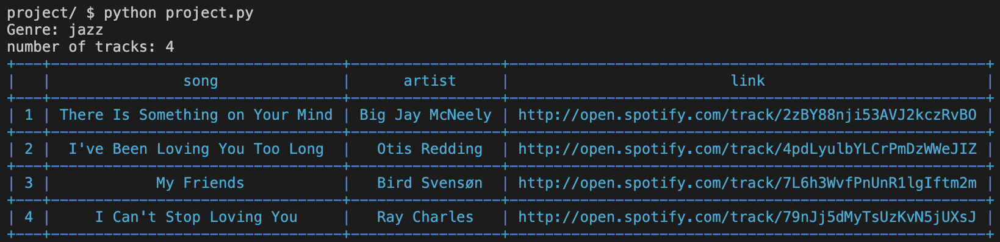

### Spotifee 

  

### About
This program generates music playlist with specific genre and track numbers. 
Track in the playlist are randomly choosen with genre filter. 
Every playlist is unique. 
Your playlist is printed in the form of table and save in csv file on your computer. 
All data is providet by Spotify API [more info](https://developer.spotify.com/documentation/web-api "Spotify Api")

### Usage:
1. Clone it:
`git clone  https://github.com/wojocode/Spotifee.git`

2. Requirements:
- requests
- prettytable

3. Run it:
`python get_music.py`